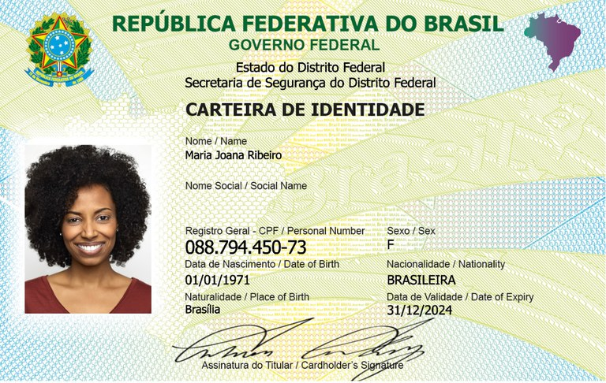
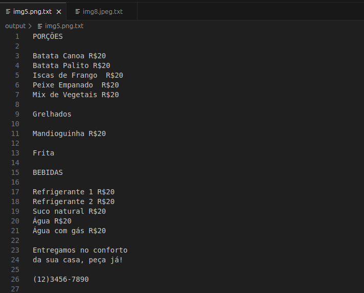
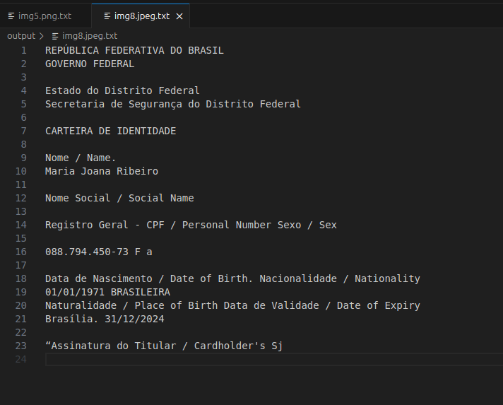

# Projeto de Reconhecimento de Texto com IA

Este projeto utiliza OCR (Reconhecimento Óptico de Caracteres) para extrair textos de imagens. O objetivo é processar imagens e identificar qualquer texto presente nelas, transformando-o em formato digital.
Foi desenvolvido como parte do Bootcamp na DIO, explorando conceitos de IA Generativa e processamento de imagens.

## 📸 Prints do Processo

🔹 Imagem de entrada:

🔹 Texto extraído:

Este é um exemplo de texto extraído de uma imagem.

## 🚀 Como Funciona

O usuário coloca imagens que tenham texto nela na pasta inputs/.

O script em Python processa as imagens e extrai os textos.

Os textos extraídos são salvos na pasta output/.

## 🛠️ Tecnologias Utilizadas

Python 3

Tesseract OCR

Pillow (PIL) (Manipulação de imagens)

OpenCV

pytesseract (Biblioteca de OCR)

## 📌 Como Rodar o Projeto

Clone o repositório:

git clone https://github.com/seu-usuario/Projeto-IA-Generativa.git
cd Projeto-IA-Generativa

Criar e Ativar o Ambiente Virtual

python -m venv venv
source venv/bin/activate  # Para Linux/Mac
venv\Scripts\activate  # Para Windows

Instalar Dependências

pip install -r requirements.txt

Instalar o Tesseract OCR

Linux (Ubuntu/Debian):

sudo apt install tesseract-ocr

Windows:

Baixe e instale o Tesseract OCR aqui

Adicione o caminho do executável ao PATH do sistema

Adicione imagens na pasta inputs/.

 Executar o Código

python main.py

Os textos extraídos aparecerão na pasta output/.

## 📚 Aprendizados e Insights

O OCR funciona melhor com imagens de alta qualidade.

Ferramentas como o Azure AI podem melhorar a precisão do reconhecimento.
## 🔗 Links Importantes

Azure AI Search-
https://learn.microsoft.com/en-us/azure/search/

Documentação do Pytesseract-
https://pypi.org/project/pytesseract/
